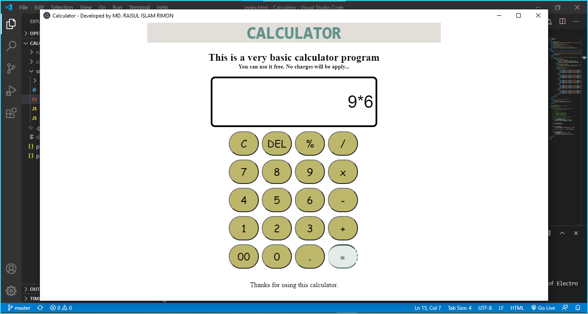

# Calculator-by-electron-desktop-app
This is a simple desktop calculator app, i have used html5, css3, javascript, jquery &amp; electron.

I have convert it from simple web calculator to desktop calculator app.
I have used electron to do this project.

If you think this works fine, then you can use it.

